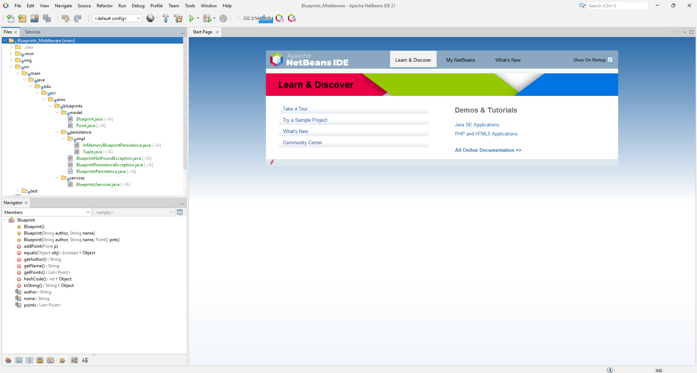
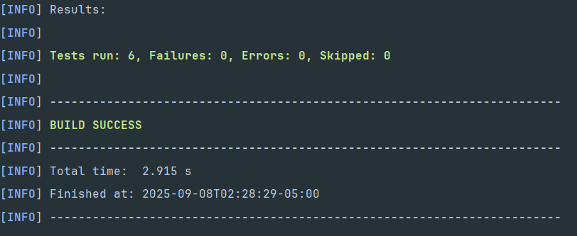
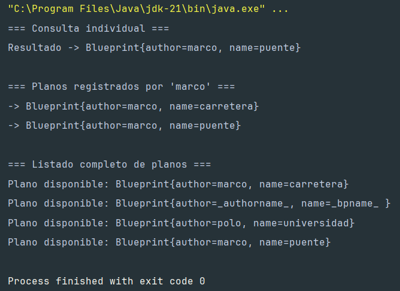
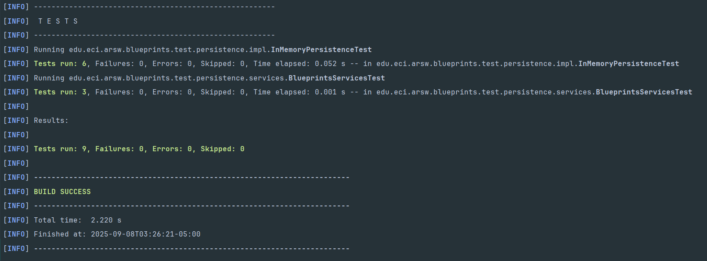

# Laboratorio - Componentes y conectores - Parte I.
## Autor - Sebastian Galvis Briceño


# Taller – Principio de Inversión de dependencias, Contenedores Livianos e Inyección de dependencias.

## Parte 1 - Ejercicio básico

Para ilustrar el uso del framework Spring, y el ambiente de desarrollo para el uso del mismo a través de Maven (y NetBeans), se hará la configuración de una aplicación de análisis de textos, que hace uso de un verificador gramatical que requiere de un corrector ortográfico. A dicho verificador gramatical se le inyectará, en tiempo de ejecución, el corrector ortográfico que se requiera (por ahora, hay dos disponibles: inglés y español).

1. Abra el los fuentes del proyecto en NetBeans.
   
2. Revise el archivo de configuración de Spring ya incluido en el proyecto (src/main/resources). El mismo indica que Spring buscará automáticamente los 'Beans' disponibles en el paquete indicado.

3. Haciendo uso de la configuración de Spring basada en anotaciones marque con las anotaciones @Autowired y @Service las dependencias que deben inyectarse, y los 'beans' candidatos a ser inyectadas -respectivamente-:
   * GrammarChecker será un bean, que tiene como dependencia algo de tipo 'SpellChecker'. 
   * EnglishSpellChecker y SpanishSpellChecker son los dos posibles candidatos a ser inyectados. Se debe seleccionar uno, u otro, mas NO ambos (habría conflicto de resolución de dependencias). Por ahora haga que se use EnglishSpellChecker.

   **Desarrollo:** 
   * **GrammarChecker:** Lo marcamos como *bean* y ponemos *@Autowired* a su dependencia:

   ``` java
   (...)
   import org.springframework.beans.factory.annotation.Autowired;
   import org.springframework.stereotype.Service;
   
   @Service
   public class GrammarChecker {

	    @Autowired
	    SpellChecker sc;
   (...)
   ```
   * **EnglishSpellChecker:** Lo marcamos como candidato a bean con *@Service* y como *@Primary* para que Spring sepa que es este el cual debe de inyectarse.
   ``` java
   (...)
   import org.springframework.context.annotation.Primary;
   import org.springframework.stereotype.Service;

   @Service
   @Primary
   public class EnglishSpellChecker implements SpellChecker {
   (...)
   ```
   * **SpanishSpellChecker** Lo marcamos también como bean para poder usarlo más adelante si así lo necesitamos.
   ``` java
   (...)
   import org.springframework.stereotype.Service;

   @Service
   public class SpanishSpellChecker implements SpellChecker {
   (...)
   ```
   
4. Haga un programa de prueba, donde se cree una instancia de GrammarChecker mediante Spring, y se haga uso de la misma:
   ``` java
   public static void main(String[] args) {
       ApplicationContext ac=new ClassPathXmlApplicationContext("applicationContext.xml");
       GrammarChecker gc=ac.getBean(GrammarChecker.class);
       System.out.println(gc.check("la la la "));
   }
   ```
   En este caso, ya no se necesita *applicationContext.xml*, se puede activar escaneo de componentes 

   Se puede crear una clase de configuración o usar *@ComponentScan*.
   ``` java
   @Configuration
   @ComponentScan("edu.eci.arsw.springdemo")
   public class Main {
       public static void main(String[] args) {
       ApplicationContext ac = new AnnotationConfigApplicationContext(Main.class);
          GrammarChecker gc = ac.getBean(GrammarChecker.class);
          System.out.println(gc.check("la la la "));
       }
   }
   ```
   

5. Modifique la configuración con anotaciones para que el Bean ‘GrammarChecker‘ ahora haga uso del la clase SpanishSpellChecker (para que a GrammarChecker se le inyecte EnglishSpellChecker en lugar de SpanishSpellChecker. Verifique el nuevo resultado.

   **Desarrollo:** Para resolver el quinto punto basta únicamente con quitar el *@Primary* de la clase en inglés y pasarlo a la de español.

De esta forma damos por finalizado el ejercicio previo, sin embargo, cabe aclarar que hay un claro error que impide la ejecución, al investigar en foros se concluyó la siguiente causa:

El problema es que Spring 4 usa CGLIB para generar proxies internos, y esa librería intenta acceder a métodos privados de la clase ClassLoader. 
En Java 9 en adelante (y mucho más en Java 17/21), eso está prohibido por el sistema de módulos (Jigsaw); de ahí el InaccessibleObjectException.


# Laboratorio - Componentes y conectores - Parte 1
En este ejercicio se va a construír un modelo de clases para la capa lógica de una aplicación que permita gestionar planos arquitectónicos de una prestigiosa compañia de diseño.


1. Configure la aplicación para que funcione bajo un esquema de inyección de dependencias, tal como se muestra en el diagrama anterior.

   Lo anterior requiere:
   * Agregar las dependencias de Spring. 
   * Agregar la configuración de Spring. 
   * Configurar la aplicación -mediante anotaciones- para que el esquema de persistencia sea inyectado al momento de ser creado el bean 'BlueprintServices'.

   **Desarrollo:** Será necesario empezar por crear la clase de configuración de la forma:
   ``` java
   package edu.eci.arsw.blueprints;

   import org.springframework.context.annotation.ComponentScan;
   import org.springframework.context.annotation.Configuration;

   @Configuration
   @ComponentScan(basePackages = {"edu.eci.arsw.blueprints"})
   public class AppConfig {

   }
   ```
   Ahora, será necesario marcar con *@Repository* la clase *InMemoryBlueprintPersistence* para que SpringBoot la asigne como la encargada de la persistencia. Asignángola en el gestor como un bean de datos.
   ``` java
   (...)
   @Repository
   public class InMemoryBlueprintPersistence implements BlueprintsPersistence{
   (...)
   ```
   El siguiente paso será modificar la clase *BlueprintsServices* de la forma:
   ``` java
   (...)
   @Service
   public class BlueprintsServices {

      private final BlueprintsPersistence bpp;

      @Autowired
      public BlueprintsServices(BlueprintsPersistence bpp) {
         this.bpp = bpp;
      }
   (...)
   ```
   Por útlimo, para solucionar los invonvenientes del ejercicio previo, será necesario agregar las siguientes dependencias a la lista de dependencias:
   ``` xml
   (...)
   <dependency>
            <groupId>org.springframework</groupId>
            <artifactId>spring-core</artifactId>
            <version>5.3.30</version>
        </dependency>
        <dependency>
            <groupId>org.springframework</groupId>
            <artifactId>spring-context</artifactId>
            <version>5.3.30</version>
        </dependency>
        <dependency>
            <groupId>org.springframework</groupId>
            <artifactId>spring-test</artifactId>
            <version>5.3.30</version>
            <scope>test</scope>
        </dependency>
   (...)
   ```

2. Complete las operaciones *getBluePrint()* y *getBlueprintsByAuthor()*. Implemente todo lo requerido de las capas inferiores (por ahora, el esquema de persistencia disponible *'InMemoryBlueprintPersistence'*) agregando las pruebas correspondientes en *'InMemoryPersistenceTest'*.
   
   **Desarrollo:** Lo primero será modificar la interfaz *BlueprintsPersistence*, aprovechando la excepción ya existente *BlueprintNotFoundException*.
   ``` java
   (...)
   public interface BlueprintsPersistence {

     /**
     * Get a set with all existing blueprints
     * @return All blueprints in a java Set
     */
     public Set<Blueprint> getAllBlueprints();

     /**
     * Get a set with all blueprints filtered by author
     * @param author Blueprint's author in String
     * @return All blueprints filtered by author in a java Set
     * @throws BlueprintNotFoundException If the provided author doesn't exist
     */
     public Set<Blueprint> getBlueprintsByAuthor(String author) throws BlueprintNotFoundException;
   (...)
   ```
   Habiendo modificado la interfaz, tendremos que proceder a implemetar los métodos *getAllBlueprints()* y *getBlueprintsByAuthor()* en la clase *InMemoryBlueprintPersistence* de la forma:
   ``` java
   (...)
   @Override
    public Set<Blueprint> getAllBlueprints() {
        return new HashSet<>(blueprints.values());
    }

    @Override
    public Set<Blueprint> getBlueprintsByAuthor(String author) throws BlueprintNotFoundException {
        Set<Blueprint> result = blueprints.entrySet().stream()
                .filter(e -> author.equals(e.getKey().getElem1()))
                .map(Map.Entry::getValue)
                .collect(Collectors.toSet());

        if (result.isEmpty()) {
            throw new BlueprintNotFoundException("No blueprints has found for the specified author: " + author);
        }
        return result;
    }
   (...)
   ```
   Por último, para poder validar en las pruebas que todo está en orden, solo falta implementar los métodos de *BlueprintsServices*.
   ``` java
   (...)
   /**
     * Add a blueprint to the repository
     * @param bp blueprint to add
     */
    public void addNewBlueprint(Blueprint bp){
        try {
            bpp.saveBlueprint(bp);
        } catch (edu.eci.arsw.blueprints.persistence.BlueprintPersistenceException ex) {
            throw new IllegalStateException("Cannot save specified blueprint", ex);
        }
    }

    /**
     * Gets a copy of all existing blueprints
     * @return A java HashSet with all existing blueprints
     */
    public Set<Blueprint> getAllBlueprints(){
        return new HashSet<>(bpp.getAllBlueprints());
    }
    
    /**
     * Get a blueprint by author and specified name
     * @param author blueprint's author
     * @param name blueprint's name
     * @return the blueprint of the given name created by the given author
     * @throws BlueprintNotFoundException if there is no such blueprint
     */
    public Blueprint getBlueprint(String author,String name) throws BlueprintNotFoundException{
        return bpp.getBlueprint(author, name);
    }
    
    /**
     * Get all blueprints of a specified author
     * @param author blueprint's author
     * @return all the blueprints of the given author
     * @throws BlueprintNotFoundException if the given author doesn't exist
     */
    public Set<Blueprint> getBlueprintsByAuthor(String author) throws BlueprintNotFoundException{
        return bpp.getBlueprintsByAuthor(author);
    }
   (...)
   ```
   Ahora, completamos la clase de pruebas, agregando las siguientes pruebas:
   ``` java
   @Test
    public void shouldReturnAllBlueprintsByAuthor() throws Exception {
        InMemoryBlueprintPersistence storage = new InMemoryBlueprintPersistence();

        Point[] pointsA = { new Point(5, 5), new Point(10, 10) };
        Blueprint house = new Blueprint("sebastian", "plano001", pointsA);
        storage.saveBlueprint(house);

        Point[] pointsB = { new Point(15, 15), new Point(20, 20) };
        Blueprint apartment = new Blueprint("sebastian", "plano002", pointsB);
        storage.saveBlueprint(apartment);

        Set<Blueprint> result = storage.getBlueprintsByAuthor("sebastian");

        assertEquals("El autor debería tener exactamente dos planos registrados",
                2, result.size());
        assertTrue("El conjunto debe contener los planos guardados",
                result.contains(house) && result.contains(apartment));
    }

    @Test(expected = BlueprintNotFoundException.class)
    public void shouldThrowExceptionWhenAuthorDoesNotExist() throws Exception {
        InMemoryBlueprintPersistence storage = new InMemoryBlueprintPersistence();
        storage.getBlueprintsByAuthor("autorInexistente");
    }

    @Test
    public void shouldReturnAllStoredBlueprints() throws Exception {
        InMemoryBlueprintPersistence repository = new InMemoryBlueprintPersistence();

        Blueprint plan1 = new Blueprint("marco", "plano003", new Point[]{ new Point(1, 1), new Point(2, 2) });
        Blueprint plan2 = new Blueprint("polo", "plano004", new Point[]{ new Point(3, 3), new Point(4, 4) });

        repository.saveBlueprint(plan1);
        repository.saveBlueprint(plan2);

        Set<Blueprint> allBlueprints = repository.getAllBlueprints();

        assertTrue("El conjunto de planos debe contener el primero guardado", allBlueprints.contains(plan1));
        assertTrue("El conjunto de planos debe contener el segundo guardado", allBlueprints.contains(plan2));
    }

    @Test
    public void shouldRetrieveBlueprintByAuthorAndName() throws Exception {
        InMemoryBlueprintPersistence storage = new InMemoryBlueprintPersistence();

        Point[] coordinates = { new Point(7, 7), new Point(14, 14) };
        Blueprint customPlan = new Blueprint("goku", "planEspecial", coordinates);

        storage.saveBlueprint(customPlan);

        Blueprint fetched = storage.getBlueprint("goku", "planEspecial");

        assertNotNull("El blueprint recuperado no debería ser nulo", fetched);
        assertEquals("El blueprint recuperado debería ser igual al que se guardó", customPlan, fetched);
        assertArrayEquals("Los puntos deberían coincidir exactamente",
                customPlan.getPoints().toArray(), fetched.getPoints().toArray());
    }
   ```
   


3. Haga un programa en el que cree (mediante Spring) una instancia de *BlueprintServices*, y rectifique la funcionalidad del mismo: registrar planos, consultar planos, registrar planos específicos, etc.
   ``` java
   public class MainApp {

    public static void main(String[] args) throws Exception {
        // Inicialización del contexto de Spring
        ApplicationContext context = new AnnotationConfigApplicationContext(AppConfig.class);
        BlueprintsServices blueprintService = context.getBean(BlueprintsServices.class);

        // Definición de planos iniciales
        Blueprint planoPuente = new Blueprint("marco", "puente", new Point[]{
                new Point(0, 0), new Point(10, 10)
        });
        Blueprint planoCarretera = new Blueprint("marco", "carretera", new Point[]{
                new Point(5, 5), new Point(15, 15)
        });
        Blueprint planoUniversidad = new Blueprint("polo", "universidad", new Point[]{
                new Point(20, 20), new Point(30, 30)
        });

        // Registro en el servicio
        blueprintService.addNewBlueprint(planoPuente);
        blueprintService.addNewBlueprint(planoCarretera);
        blueprintService.addNewBlueprint(planoUniversidad);

        // Consulta individual
        System.out.println("=== Consulta individual ===");
        Blueprint recuperado = blueprintService.getBlueprint("marco", "puente");
        System.out.println("Resultado -> " + recuperado);

        // Consulta por autor
        System.out.println("\n=== Planos registrados por 'marco' ===");
        for (Blueprint bp : blueprintService.getBlueprintsByAuthor("marco")) {
            System.out.println("-> " + bp);
        }

        // Consulta global
        System.out.println("\n=== Listado completo de planos ===");
        blueprintService.getAllBlueprints().forEach(bp -> {
            System.out.println("Plano disponible: " + bp);
        });
    }
   }
   ```
   
   

4. Se quiere que las operaciones de consulta de planos realicen un proceso de filtrado, antes de retornar los planos consultados. Dichos filtros lo que buscan es reducir el tamaño de los planos, removiendo datos redundantes o simplemente submuestrando, antes de retornarlos. Ajuste la aplicación (agregando las abstracciones e implementaciones que considere) para que a la clase *BlueprintServices* se le inyecte uno de dos posibles 'filtros' (o eventuales futuros filtros). No se contempla el uso de más de uno a la vez:
   * (A) Filtrado de redundancias: suprime del plano los puntos consecutivos que sean repetidos.
   * (B) Filtrado de submuestreo: suprime 1 de cada 2 puntos del plano, de manera intercalada.

   **Desarrollo:** Lo primero será crear la interfaz, después le indicaremos a spring boot cuál implementación usar
   ``` java
   public interface Filter {
      Blueprint applyFilter(Blueprint bp);
   }
   ```
   Y ahora, implementaremos ambos filtros:
   ``` java
   @Component("redundancyFilter")
   public class RedundancyFilter implements Filter {

    @Override
    public Blueprint applyFilter(Blueprint blueprint) {
        List<Point> uniquePoints = new LinkedList<>();
        Point lastPoint = null;

        for (Point current : blueprint.getPoints()) {
            if (lastPoint == null || (lastPoint.getX() != current.getX() || lastPoint.getY() != current.getY())) {
                uniquePoints.add(current);
            }
            lastPoint = current;
        }

        Point[] resultArray = uniquePoints.toArray(new Point[uniquePoints.size()]);
        return new Blueprint(blueprint.getAuthor(), blueprint.getName(), resultArray);
    }
   }
   ```
   ``` java
   @Component("subsamplingFilter")
   public class UndersamplingFilter implements Filter {

    @Override
    public Blueprint applyFilter(Blueprint original) {
        List<Point> sampledPoints = new LinkedList<>();
        List<Point> allPoints = original.getPoints();

        int index = 0;
        for (Point p : allPoints) {
            if (index % 2 == 0) {
                sampledPoints.add(p);
            }
            index++;
        }

        Point[] finalSet = sampledPoints.toArray(new Point[sampledPoints.size()]);
        return new Blueprint(original.getAuthor(), original.getName(), finalSet);
    }
   }
   ```
   Y para terminar la implementación de los filtros, seleccionaremos aquel filtro de nuestra elección y lo indicaremos de la forma:
   ``` java
   (...)
   /**
     * A) 'redundancyFilter' para filtrado de redundancias
     * B) 'undersamplingFilter' para filtrado de submuestreo
     */
    @Qualifier("redundancyFilter")
    private final Filter filter;
   (...)
   ```
   
   Lo último que resta es modificar *BlueprintsServices* para que use dichos filtros, así, la clase quedaría de la forma:
   ``` java
   @Service
   public class BlueprintsServices {

    private final BlueprintsPersistence bpp;
    /**
     * A) 'redundancyFilter' para filtrado de redundancias
     * B) 'undersamplingFilter' para filtrado de submuestreo
     */
    @Qualifier("redundancyFilter")
    private final Filter filter;

    @Autowired
    public BlueprintsServices(BlueprintsPersistence bpp, Filter filter){
        this.bpp = bpp;
        this.filter = filter;
    }

    /**
     * Add a blueprint to the repository
     * @param bp blueprint to add
     */
    public void addNewBlueprint(Blueprint bp){
        try {
            bpp.saveBlueprint(bp);
        } catch (edu.eci.arsw.blueprints.persistence.BlueprintPersistenceException ex) {
            throw new IllegalStateException("Cannot save specified blueprint", ex);
        }
    }

    /**
     * Gets a copy of all existing blueprints
     * @return A java HashSet with all existing blueprints
     */
    public Set<Blueprint> getAllBlueprints(){
        //return new HashSet<>(bpp.getAllBlueprints());
        Set<Blueprint> originals = bpp.getAllBlueprints();
        Set<Blueprint> processed = new HashSet<>();

        for (Blueprint bp : originals) {
            Blueprint filtered = filter.applyFilter(bp);
            processed.add(filtered);
        }

        return processed;
    }
    
    /**
     * Get a blueprint by author and specified name
     * @param author blueprint's author
     * @param name blueprint's name
     * @return the blueprint of the given name created by the given author
     * @throws BlueprintNotFoundException if there is no such blueprint
     */
    public Blueprint getBlueprint(String author,String name) throws BlueprintNotFoundException{
        return filter.applyFilter(bpp.getBlueprint(author, name));
    }
    
    /**
     * Get all blueprints of a specified author
     * @param author blueprint's author
     * @return all the blueprints of the given author
     * @throws BlueprintNotFoundException if the given author doesn't exist
     */
    public Set<Blueprint> getBlueprintsByAuthor(String author) throws BlueprintNotFoundException{
        Set<Blueprint> authored = bpp.getBlueprintsByAuthor(author);
        Set<Blueprint> result = new HashSet<>();

        for (Blueprint bp : authored) {
            result.add(filter.applyFilter(bp));
        }

        return result;
    }

   }
   ```   


5. Agrege las pruebas correspondientes a cada uno de estos filtros, y pruebe su funcionamiento en el programa de prueba, comprobando que sólo cambiando la posición de las anotaciones -sin cambiar nada más-, el programa retorne los planos filtrados de la manera (A) o de la manera (B).
   
   **Desarrollo:** Por facilidad, se creó una nueva clase de pruebas de la forma:
   ``` java
   public class BlueprintsServicesTest {

    @Test
    public void testGetAllBlueprintsWithRedundancyFilter() throws Exception {
        InMemoryBlueprintPersistence repo = new InMemoryBlueprintPersistence();
        BlueprintsServices service = new BlueprintsServices(repo, new RedundancyFilter());

        // Plano con puntos duplicados
        Blueprint bp = new Blueprint("thor", "martillo",
                new Point[]{ new Point(1, 1), new Point(1, 1), new Point(2, 2) });
        repo.saveBlueprint(bp);

        Set<Blueprint> result = service.getAllBlueprints();
        Blueprint filtered = result.iterator().next();

        assertEquals("El filtro debería eliminar puntos duplicados", 2, filtered.getPoints().size());
    }

    @Test
    public void testGetBlueprintsByAuthorWithUnderamplingFilter() throws Exception {
        InMemoryBlueprintPersistence memory = new InMemoryBlueprintPersistence();
        Filter undersampling = new UndersamplingFilter(); // filtro real
        BlueprintsServices services = new BlueprintsServices(memory, undersampling);

        // Creamos un plano con 4 puntos
        Blueprint bp = new Blueprint("ironman", "armadura", new Point[]{
                new Point(0, 0),
                new Point(1, 1),
                new Point(2, 2),
                new Point(3, 3)
        });
        services.addNewBlueprint(bp);

        Set<Blueprint> result = services.getBlueprintsByAuthor("ironman");
        assertEquals("Debería haber un único plano para el autor", 1, result.size());

        Blueprint filtered = result.iterator().next();
        assertEquals("El filtro de submuestreo debería dejar 2 puntos", 2, filtered.getPoints().size());

        // Verificamos los puntos restantes por coordenadas
        Point first = filtered.getPoints().get(0);
        Point second = filtered.getPoints().get(1);

        assertEquals(0, first.getX());
        assertEquals(0, first.getY());

        assertEquals(2, second.getX());
        assertEquals(2, second.getY());
    }


    @Test
    public void testGetBlueprintWithFilter() throws Exception {
        InMemoryBlueprintPersistence repo = new InMemoryBlueprintPersistence();
        BlueprintsServices service = new BlueprintsServices(repo, new RedundancyFilter());

        // Plano con duplicados
        Blueprint bp = new Blueprint("hulk", "puño",
                new Point[]{ new Point(5, 5), new Point(5, 5), new Point(10, 10) });
        repo.saveBlueprint(bp);

        Blueprint filtered = service.getBlueprint("hulk", "puño");

        assertEquals("El filtro debería devolver solo 2 puntos", 2, filtered.getPoints().size());
    }
   }
   ```
   


# Conclusión - Laboratorio
El desarrollo de este laboratorio permitió comprender y aplicar de manera práctica los principios de Inversión de Dependencias, Contenedores Livianos e Inyección de Dependencias, haciendo uso del framework Spring. A través de los ejercicios planteados, se evidenció cómo la gestión de dependencias mediante anotaciones y configuración elimina el acoplamiento rígido en las aplicaciones, permitiendo mayor flexibilidad y escalabilidad.

En la primera parte, con el ejemplo del GrammarChecker, se estableció la base conceptual para entender cómo Spring administra los beans y selecciona dinámicamente las implementaciones de una interfaz (en este caso, SpellChecker en inglés o español), garantizando un desarrollo modular y fácilmente extensible.

Posteriormente, al implementar la aplicación de gestión de planos, se consolidó el uso de inyección de dependencias en un escenario más complejo, integrando la capa de persistencia, los servicios y, finalmente, la inclusión de filtros de procesamiento. Estos filtros, configurados también mediante Spring, mostraron cómo la arquitectura puede adaptarse a distintos comportamientos sin necesidad de modificar el código central, únicamente cambiando la implementación inyectada.

Finalmente, con la construcción de pruebas unitarias y de integración, se validó el correcto funcionamiento del sistema en sus diferentes capas, asegurando la calidad del software y verificando la eficacia de los filtros implementados.

En conclusión, este laboratorio no solo permitió afianzar el uso de Spring como un contenedor liviano de inversión de dependencias, sino que también demostró la importancia de diseñar aplicaciones desacopladas, probables y mantenibles, principios clave en el desarrollo de software empresarial moderno.
